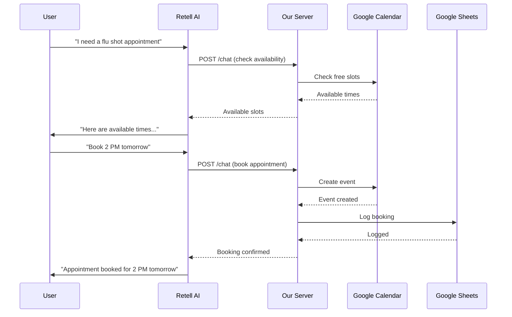
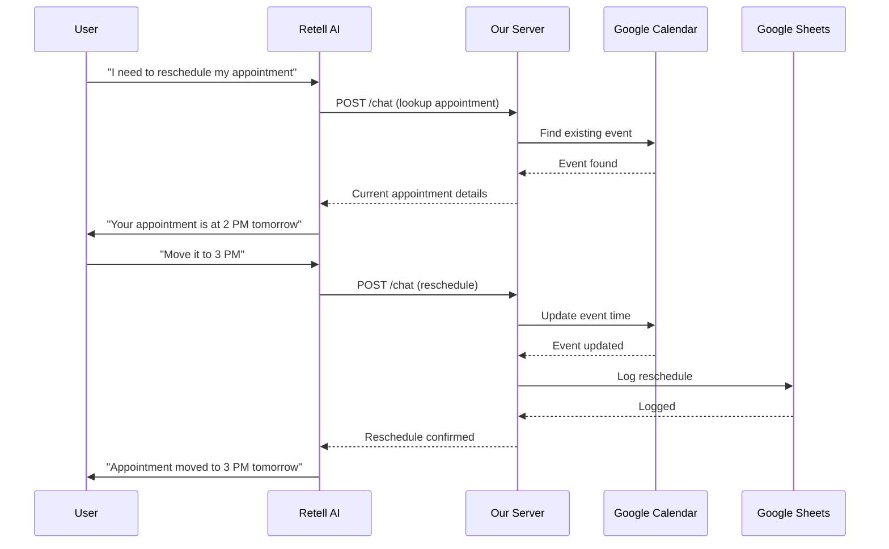
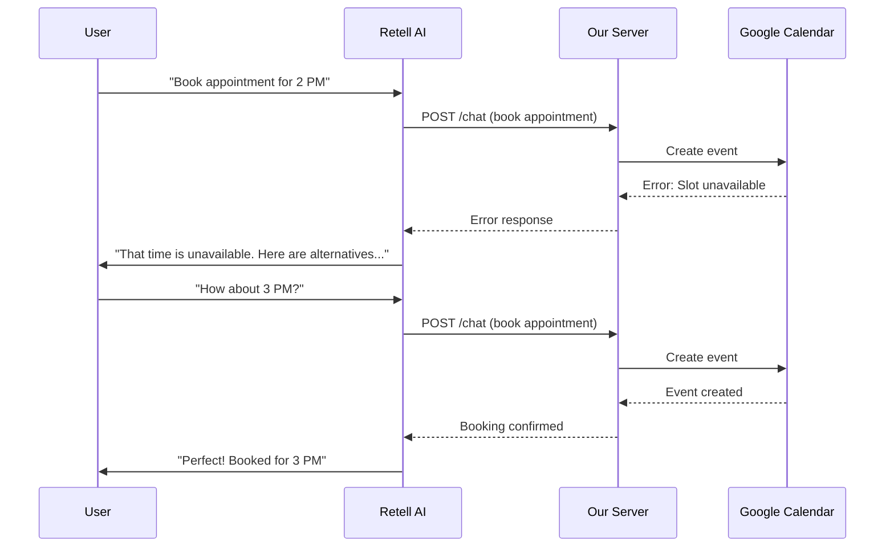
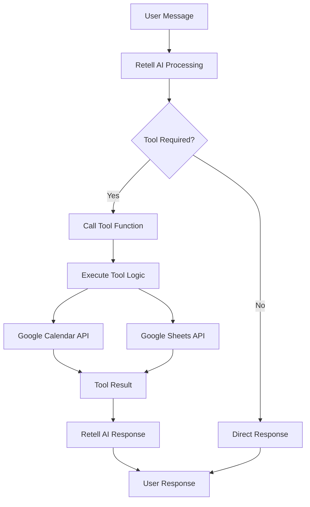
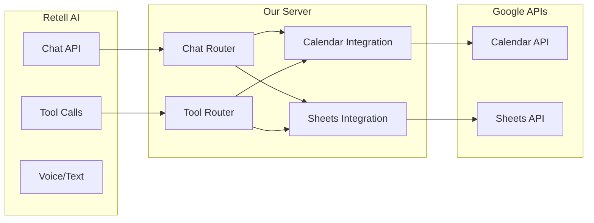
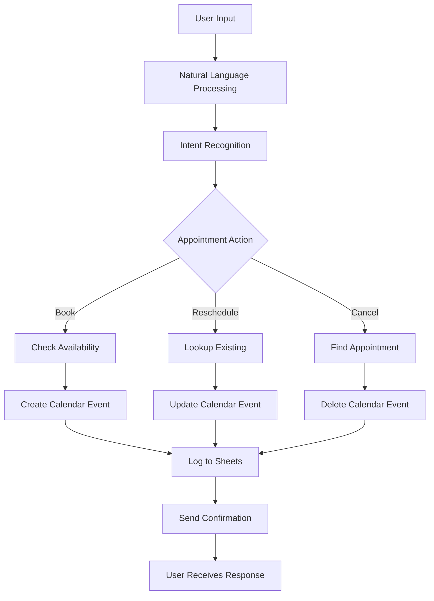

# Appointment Booking Sequence Diagram

## Booking Flow

```mermaid
sequenceDiagram
    participant U as User
    participant R as Retell AI
    participant S as Our Server
    participant GC as Google Calendar
    participant GS as Google Sheets

    U->>R: "I need a flu shot appointment"
    R->>S: POST /chat (check availability)
    S->>GC: Check free slots
    GC-->>S: Available times
    S-->>R: Available slots
    R->>U: "Here are available times..."
    
    U->>R: "Book 2 PM tomorrow"
    R->>S: POST /chat (book appointment)
    S->>GC: Create event
    GC-->>S: Event created
    S->>GS: Log booking
    GS-->>S: Logged
    S-->>R: Booking confirmed
    R->>U: "Appointment booked for 2 PM tomorrow"
```

## Reschedule Flow

```mermaid
sequenceDiagram
    participant U as User
    participant R as Retell AI
    participant S as Our Server
    participant GC as Google Calendar
    participant GS as Google Sheets

    U->>R: "I need to reschedule my appointment"
    R->>S: POST /chat (lookup appointment)
    S->>GC: Find existing event
    GC-->>S: Event found
    S-->>R: Current appointment details
    R->>U: "Your appointment is at 2 PM tomorrow"
    
    U->>R: "Move it to 3 PM"
    R->>S: POST /chat (reschedule)
    S->>GC: Update event time
    GC-->>S: Event updated
    S->>GS: Log reschedule
    GS-->>S: Logged
    S-->>R: Reschedule confirmed
    R->>U: "Appointment moved to 3 PM tomorrow"
```

## Error Handling Flow

```mermaid
sequenceDiagram
    participant U as User
    participant R as Retell AI
    participant S as Our Server
    participant GC as Google Calendar

    U->>R: "Book appointment for 2 PM"
    R->>S: POST /chat (book appointment)
    S->>GC: Create event
    GC-->>S: Error: Slot unavailable
    S-->>R: Error response
    R->>U: "That time is unavailable. Here are alternatives..."
    
    U->>R: "How about 3 PM?"
    R->>S: POST /chat (book appointment)
    S->>GC: Create event
    GC-->>S: Event created
    S-->>R: Booking confirmed
    R->>U: "Perfect! Booked for 3 PM"
```

## Tool Call Architecture

```mermaid
graph TD
    A[User Message] --> B[Retell AI Processing]
    B --> C{Tool Required?}
    C -->|Yes| D[Call Tool Function]
    C -->|No| E[Direct Response]
    D --> F[Execute Tool Logic]
    F --> G[Google Calendar API]
    F --> H[Google Sheets API]
    G --> I[Tool Result]
    H --> I
    I --> J[Retell AI Response]
    J --> K[User Response]
    E --> K
```

## System Components

```mermaid
graph LR
    subgraph "Retell AI"
        A[Chat API]
        B[Tool Calls]
        C[Voice/Text]
    end
    
    subgraph "Our Server"
        D[Chat Router]
        E[Tool Router]
        F[Calendar Integration]
        G[Sheets Integration]
    end
    
    subgraph "Google APIs"
        H[Calendar API]
        I[Sheets API]
    end
    
    A --> D
    B --> E
    D --> F
    D --> G
    E --> F
    E --> G
    F --> H
    G --> I
```

## Data Flow

```mermaid
flowchart TD
    A[User Input] --> B[Natural Language Processing]
    B --> C[Intent Recognition]
    C --> D{Appointment Action}
    D -->|Book| E[Check Availability]
    D -->|Reschedule| F[Lookup Existing]
    D -->|Cancel| G[Find Appointment]
    E --> H[Create Calendar Event]
    F --> I[Update Calendar Event]
    G --> J[Delete Calendar Event]
    H --> K[Log to Sheets]
    I --> K
    J --> K
    K --> L[Send Confirmation]
    L --> M[User Receives Response]
```
